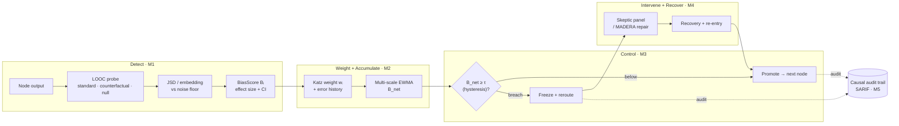
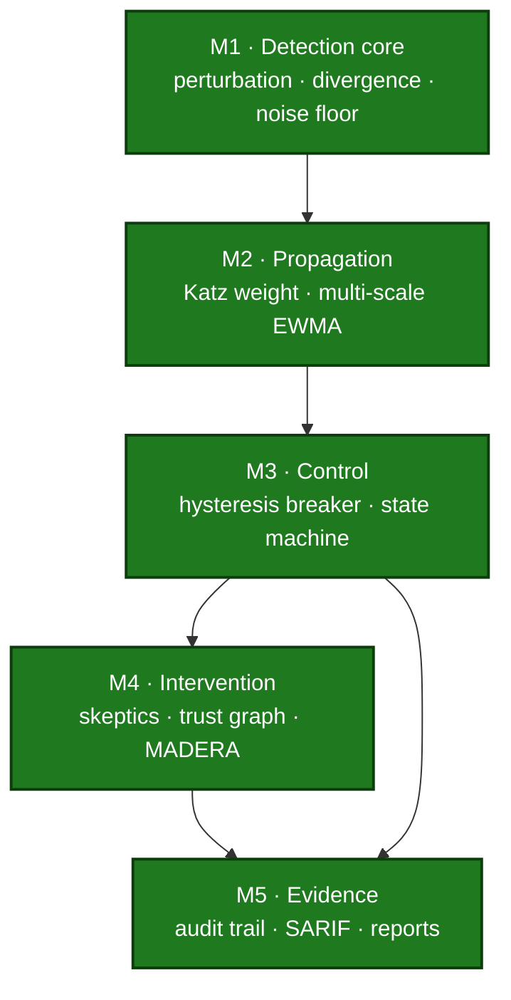

# weighted-emergent-bias

**A runtime circuit-breaker for the Degeneration-of-Thought (DoT) problem in multi-agent LLM systems.**

[](https://github.com/krishddd/weighted-emergent-bias/actions/workflows/ci.yml)


> **Status: alpha, v0.5 — all five modules shipped.** Detect per-node bias, weight + accumulate it,
> halt/reroute with hysteresis + a recovery machine, repair via a skeptic panel or MADERA, and emit an
> append-only audit trail with SARIF 2.1.0 export and HTML/JSON reports. This library makes **no
> validated performance claims** — see [Prior work](#prior-work-and-what-this-does-not-claim).

---

In a multi-agent LLM pipeline, one agent's mildly stereotyped output becomes the next agent's
ground truth. Downstream agents do not re-litigate the premise they were handed — they build
on it, and the bias compounds through the graph until every stage has homogenized around the
same skewed register. This failure mode is called **Degeneration-of-Thought (DoT)**, and
single-model alignment does not catch it: the bias is not a property of any one model's
weights, it is a property of how the agents are wired together.

`weighted-emergent-bias` is a runtime circuit-breaker for that failure. It probes each node
with a demographically perturbed counterfactual to get a local bias score, weights that score
by the node's downstream blast radius via graph centrality, accumulates the weighted scores
into a network-level moving average as the graph executes, and halts the run deterministically
when that average crosses a threshold — freezing the compromised payload and rerouting control
to a mitigation subgraph instead of letting the contaminated state propagate.

## Scope — what this detects, and what it does not

The detector is a **within-node counterfactual invariance test**: it compares a node's output
to its *own* output on a demographically perturbed input, anchored to the node's own
sampling-noise floor — **never** to the other agents' consensus.

| ✅ Detects | ❌ Does not detect |
| --- | --- |
| Demographic / stereotype bias — a node treating an input differently because of a protected attribute or its proxy | **Factual error** — a node can be perfectly invariant and still wrong (needs an external oracle; offered only as an optional injectable verifier) |
| Bias amplified through the graph topology | **Consensus deviation** — a lone correct dissenter is never flagged for disagreeing |
| Slow drift *and* sudden spikes (multi-scale accumulation) | **Style drift** as a bias signal — kept as a separate axis, not conflated |

Keeping the claim this narrow is what makes it defensible: the whole noise-floor apparatus
supports *this* statement and no broader one. See [docs/DESIGN.md §0](docs/DESIGN.md).

## How it works



| Stage | Mechanism |
| --- | --- |
| **Detect** | LOOC probes each node with a demographically perturbed counterfactual and measures the divergence (true Jensen–Shannon over a shared candidate support, or an embedding distance for free-form output) **net of the node's own sampling noise**. |
| **Weight** | Katz centrality over the *transposed* agent DAG gives each node a dependency weight `wᵢ` (downstream blast radius), complemented by a Bayesian error-history score. |
| **Accumulate** | Fast + slow bias-corrected EWMAs track `B_net` across supersteps — the fast scale catches spikes, the slow scale catches drift. |
| **Break** | A two-threshold hysteresis controller (`τ_enter` > `τ_exit`) halts execution deterministically and freezes the payload — before the downstream node consumes it. |
| **Intervene** | Conformity spirals route to parallel Skeptic Agents under a trust graph; parametric bias routes to a MADERA-style diagnose → retrieve → rewrite repair, then a guarded re-entry. |
| **Audit** | Every probe, divergence, weight, and routing decision lands in an append-only causal trail, exportable as SARIF or HTML. |

## Design principles

- **Framework-agnostic core.** Scoring, topology, accumulation, and breaker logic depend only
  on numpy and networkx. LangGraph is the reference adapter, shipped as an optional extra.
- **Bring your own model.** No bundled LLM SDK. You supply a client callable; the library
  supplies the protocols, the math, and reference agents.
- **Noise floor, always.** An LLM sampled twice on identical input diverges from itself. Every
  score is reported net of an empirically estimated per-node null, as a standardized effect
  size with a confidence interval. Thresholding raw divergence would just threshold temperature.
- **No silent coverage gaps.** When probing is sampled or skipped for cost, the sampling rate
  is recorded in the audit trail. A partial scan never reports as a full one.

## Install

```bash
pip install -e ".[dev]"        # from a clone; not yet on PyPI
```

Requires Python 3.10+. Runtime deps are just `numpy` and `networkx`; `langgraph` is an
optional extra (`pip install -e ".[langgraph]"`).

## Quickstart (what runs today)

The perturbation engine and the ground-truth fake client are usable now:

```python
from weighted_emergent_bias import AxisSpec, Substitution, perturb

gender = AxisSpec(
    name="gender",
    substitutions=(Substitution("he", "she"), Substitution("his", "her")),
)

perts = perturb("He submitted his application", [gender])
print(perts[0].perturbed)  # -> "She submitted her application"
```

Perturbation walks nested payloads (dicts, lists) and edits only string leaves; structure,
keys, and non-string values are held fixed. Explicit and proxy substitutions produce separate
perturbations. See [docs/example-axes.md](docs/example-axes.md) for illustrative axis sets
(no axis list ships as a default — that is a deliberate choice).

Propagation (M2) weights each node's bias by its downstream blast radius and accumulates a
network-level signal across execution:

```python
from weighted_emergent_bias import AgentDAG, NetworkAccumulator, dependency_weights

dag = AgentDAG([("router", "worker"), ("router", "judge"), ("worker", "judge")])
weights = dependency_weights(dag).weights  # Katz blast radius, normalized

acc = NetworkAccumulator()  # fast + slow bias-corrected EWMA
state = acc.update({"router": 0.4}, weights)  # a biased central node fires
print(round(state.fast, 3))  # B_net rises with weighted node bias
```

The end-to-end detect→weight→accumulate path is exercised by the
[DoT simulation harness](src/weighted_emergent_bias/testing/dot_harness.py); results are in the
[propagation study](docs/studies/phase2-propagation.md).

Control (M3) halts deterministically on breach, with hysteresis to avoid thrashing and a recovery
state machine:

```python
from weighted_emergent_bias import CircuitBreaker, ControlMachine

machine = ControlMachine(CircuitBreaker(tau_enter=0.3, tau_exit=0.15))
decision = machine.step(fast=0.5, slow=0.1)  # a spike above tau_enter
print(decision.action, decision.state)  # BreakerAction.REROUTE BreakerState.INTERVENTION
```

The breaker trips once and stays tripped until `B_net` falls below the lower `tau_exit`; a
persistent breach escalates instead of looping. Thresholds come from `calibrate_thresholds` on
control runs (no magic constant). The optional
[LangGraph adapter](src/weighted_emergent_bias/integrations/langgraph/) stages each node's output
and only promotes it once the breaker clears — so a biased payload never reaches the next node.
See the [control study](docs/studies/phase3-control.md).

Intervention (M4) repairs a halted run: a conformity spiral routes to a skeptic panel under a trust
graph that prunes overconfident agents (but **never** a correct dissenter); entrenched parametric
bias routes to a MADERA-style diagnose→retrieve→rewrite loop. Everything is protocol + reference
implementation over an injected LLM callable. The `InterventionRunner` wires this into the M3
recovery hook; because M3 re-measures `B_net`, a genuine repair drives the run back to Normal. See
the [intervention study](docs/studies/phase4-intervention.md), where trust-weighting recovers the
correct output that plain majority-voting loses.

## Roadmap

Five layered modules — see [docs/ROADMAP.md](docs/ROADMAP.md). Each earlier module is a
number the later ones transform, so the order is not negotiable and M1 carries the real risk.



| | Module | Ships as | Status |
| --- | --- | --- | --- |
| **M1** | Detection core — perturbation, divergence, noise floor, probe | v0.1 | ✅ shipped ([calibration study](docs/studies/phase1-calibration.md)) |
| **M2** | Propagation — Katz weighting, multi-scale EWMA | v0.2 | ✅ shipped ([propagation study](docs/studies/phase2-propagation.md)) |
| **M3** | Control — hysteresis breaker, recovery state machine, LangGraph adapter | v0.3 | ✅ shipped ([control study](docs/studies/phase3-control.md)) |
| **M4** | Intervention — skeptic panel, trust-graph pruning, MADERA | v0.4 | ✅ shipped ([intervention study](docs/studies/phase4-intervention.md)) |
| **M5** | Evidence — causal trail, SARIF 2.1.0 export, reporting | v0.5 | ✅ shipped ([evidence study](docs/studies/phase5-evidence.md)) |

Module plans: [PHASE-1](docs/plans/PHASE-1.md), [PHASE-2](docs/plans/PHASE-2.md),
[PHASE-3](docs/plans/PHASE-3.md), [PHASE-4](docs/plans/PHASE-4.md), [PHASE-5](docs/plans/PHASE-5.md). The 2026-07 external-review triage is in
[docs/reviews/](docs/reviews/2026-07-external-review-response.md).

## Prior work, and what this does not claim

This design implements and adapts mechanisms from published research. Those papers' results
are **theirs, measured on their setups** — not evidence that this implementation works.

- **LOOC + Synthetic Data Calibration** — *Beyond Generation* (ACL 2025 Findings). Reports a
  57.5% label-bias reduction **in a single-model classification setting** — a different metric
  on a different unit of analysis than multi-agent emergent bias.
- **MADERA** — *Towards Fairer AI* (AAAI-SS). Reports BBQ-Hard improvements for its own
  pipeline; the reimplementation here is unvalidated.
- **MALIBU** — *Multi-Agent LLM Implicit Bias Uncovered* ([arXiv:2507.01019](https://arxiv.org/abs/2507.01019)).
  Cited as motivation; this library has not been evaluated on it.
- **CortexDebate** — source of the trust-graph pruning. Its `T = (C+R+I)/S` formula is a
  consulting heuristic, treated here as a heuristic that must beat uniform aggregation in an
  ablation before it is believed.

Benchmark reproduction is deliberately **not** on the v0.x roadmap. Until it happens, the only
claim made here is that the mechanics are implemented and demonstrable on a synthetic DoT harness.

## Contributing

See [CONTRIBUTING.md](CONTRIBUTING.md). In short: `pip install -e ".[dev]"`, then
`ruff check . && ruff format --check . && mypy && pytest`. CI runs the same across Python
3.10/3.11/3.12; the matrix is load-bearing (numpy's type stubs differ across versions).

## License

MIT — see [LICENSE](LICENSE).
