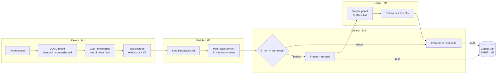

# weighted-emergent-bias

**A runtime circuit-breaker for the Degeneration-of-Thought (DoT) problem in multi-agent LLM systems.**

```bash
pip install weighted-emergent-bias
```

In a multi-agent LLM pipeline, one agent's mildly stereotyped output becomes the next agent's
ground truth. Downstream agents do not re-litigate the premise they were handed — they build on
it, and the bias compounds until every stage has homogenized around the same skewed register.
Single-model alignment does not catch this: the bias is not a property of any one model's
weights, it is a property of **how the agents are wired together**.

This library detects that per node, weights it by the node's downstream blast radius, accumulates
it across the run, and halts deterministically before a contaminated payload reaches the next
node — then repairs and audits.

## The pipeline



Each module is a number the next one transforms, so **a wrong M1 cannot be recovered
downstream** — which is why M1 carries the project's only real research risk and gets a
dedicated calibration study.

## Where to go next

| If you want to… | Read |
| --- | --- |
| Understand the design decisions and their justifications | [DESIGN](DESIGN.md) |
| See module scope, ordering, and status | [ROADMAP](ROADMAP.md) |
| See the numbers behind each module | [Studies](studies/phase1-calibration.md) |
| Pick demographic axes | [Example axes](example-axes.md) |
| See how external criticism was triaged | [2026-07 review](reviews/2026-07-external-review-response.md) |
| Get started, or read the invariants | [Wiki](https://github.com/krishddd/weighted-emergent-bias/wiki) |

## What this does not claim

This library makes **no validated-performance claims on real models**. The mechanics are
implemented and demonstrated on a synthetic DoT harness with known ground truth. Numbers from
the papers whose mechanisms are adapted here (LOOC, MADERA, MALIBU, CortexDebate) are **theirs,
measured on their setups** — they are not evidence that this implementation works. Benchmark
reproduction is deliberately unscheduled.

That discipline is the point: a claim is made here only when a test or a study in this repository
backs it.
