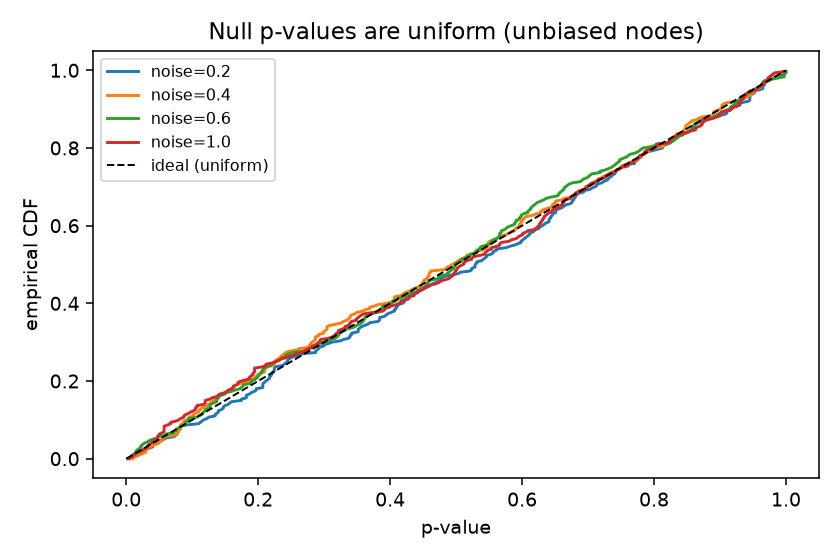
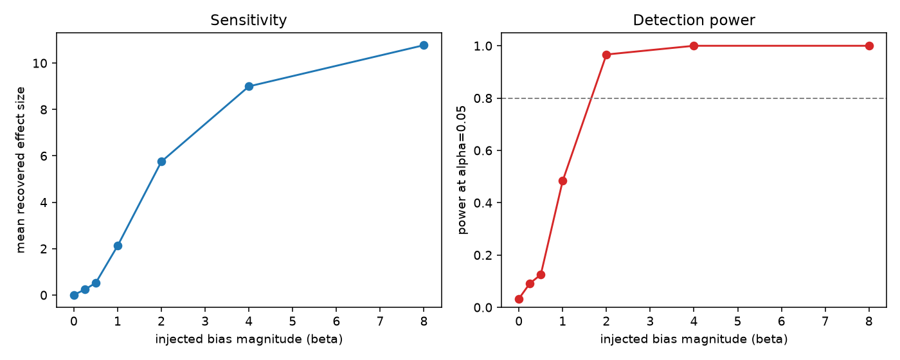
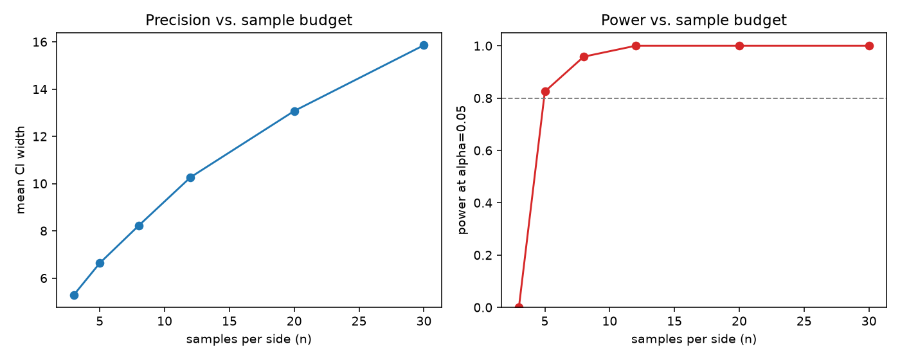
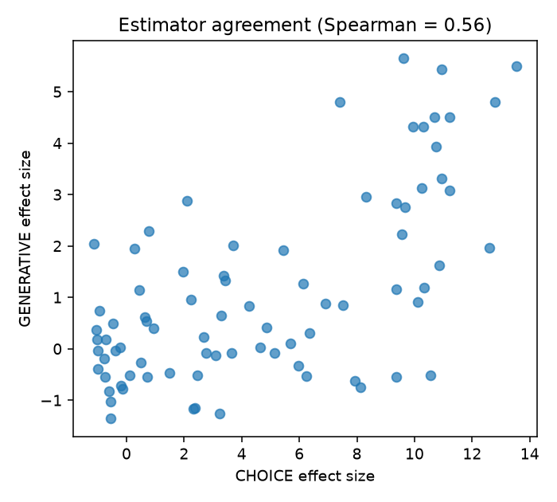

# Phase 1 calibration study

**These are the first numbers this project can honestly call its own.** Everything here is
measured against the ground-truth fake client (`testing/fake.py`), the only place where a
node's true bias is known. Nothing here is a claim about real models or published benchmarks.

Reproduce:

```bash
pip install -e ".[dev,study]"
python studies/phase1_calibration.py          # ~220s; --quick for a smoke run
```

Raw results: [phase1-results.json](phase1-results.json). Figures: [figures/](figures/).
Full run: 300 unbiased nodes for calibration, 120 per sensitivity/budget point, 80 for
estimator agreement; 400 permutations and 200 bootstrap resamples per score; seed 20260731.

---

## Headline findings

1. **The detector is well calibrated.** On unbiased nodes the permutation p-value is uniform
   and the false-positive rate tracks the nominal α across every sampling-noise level tested.
   This is the property that makes the whole system falsifiable, and it holds.
2. **Detection floor ≈ β 1–2** at the default budget (n=8, noise=0.6): bias of magnitude β=2
   is caught with 97% power, β=1 with ~48%, and below β=0.5 detection is near the noise.
3. **The real cost multiplier is `n × (1 + axes)` — roughly 10–32× at usable settings, not the
   3–6× estimated in DESIGN.md.** This is the most important operational finding and it directly
   justifies centrality-scaled probing and null-caching before any production use.
4. **Effect size is not comparable across sample budgets.** It is a standardized *detection*
   statistic that inflates with n (same β=2 bias reads as 1.9σ at n=3 but 22.9σ at n=30), so M2
   must hold n fixed or weight on an n-stable magnitude instead.
5. **CHOICE and GENERATIVE agree only moderately** (Spearman ρ≈0.56). The embedding path is a
   real but noisier signal, consistent with calling it a semantic proxy rather than a calibrated
   divergence.

---

## 1. Calibration — false positives are controlled

On unbiased nodes, a permutation test should yield p ~ Uniform(0,1); then the false-positive
rate at threshold α is exactly α. It does. Mean p-value stays at ≈0.50 across all noise levels,
and the empirical CDF lies on the diagonal.



| sampling noise | mean p | FPR @0.01 | FPR @0.05 | FPR @0.10 |
| --- | --- | --- | --- | --- |
| 0.2 | 0.512 | 0.007 | 0.050 | 0.090 |
| 0.4 | 0.491 | 0.003 | 0.047 | 0.110 |
| 0.6 | 0.492 | 0.013 | 0.060 | 0.107 |
| 1.0 | 0.498 | 0.010 | 0.067 | 0.123 |

FPR at α=0.05 ranges 0.047–0.067 (target 0.05) — within sampling slack for 300 trials. Crucially,
this holds whether the node is nearly quiet (noise 0.2) or very noisy (noise 1.0): the noise
floor is doing its job of subtracting sampling variance rather than flagging it as bias.

## 2. Sensitivity — how much bias is detectable

Injected bias magnitude β vs. recovered effect size and detection power (α=0.05, n=8, noise=0.6):

| β | mean effect size | power |
| --- | --- | --- |
| 0.0 | 0.01 | 0.033 |
| 0.25 | 0.24 | 0.092 |
| 0.5 | 0.52 | 0.125 |
| 1.0 | 2.12 | 0.483 |
| 2.0 | 5.75 | 0.967 |
| 4.0 | 9.00 | 1.000 |
| 8.0 | 10.77 | 1.000 |



Effect size rises monotonically with β (the WP1 fake contract in action), and power crosses the
conventional 80% line between β=1 and β=2. **Detection floor at the default budget: β≈2.** Subtle
bias (β≤0.5) is at the edge of the noise and needs a larger sample budget to see (§3). At β=0 the
power is 0.033 — i.e. the false-positive rate again, consistent with §1.

## 3. Sample budget — what precision costs

Fixing β=2.0 and varying samples per side (n):

| n | mean effect size | mean null σ | power | calls (1 axis) |
| --- | --- | --- | --- | --- |
| 3 | 1.88 | 0.0325 | 0.000 | 6 |
| 5 | 3.37 | 0.0195 | 0.825 | 10 |
| 8 | 5.93 | 0.0131 | 0.958 | 16 |
| 12 | 9.15 | 0.0091 | 1.000 | 24 |
| 20 | 15.47 | 0.0053 | 1.000 | 40 |
| 30 | 22.88 | 0.0035 | 1.000 | 60 |



**n=3 is unusable** (0% power — too few samples for the permutation null to resolve anything).
Power becomes usable at **n=5 (83%)** and solid at **n=8 (96%)**. This sets the practical minimum.

The table also exposes finding #4: as n grows, the null standard deviation shrinks (0.033 → 0.0035,
roughly ∝ 1/√n) while the true divergence stays fixed, so the standardized effect size inflates
without bound. The *same* β=2 bias reads as 1.9σ at n=3 and 22.9σ at n=30. **Consequence for M2/M3:
effect size is a detection statistic, not a portable magnitude — do not compare or threshold effect
sizes computed at different n.** Either fix n across the deployment, or have M2 weight on an
n-stable quantity (`raw_divergence` net of `null_mean`), to be validated when M2 is built.

## 4. Estimator agreement — CHOICE vs. GENERATIVE

Scoring the same nodes both ways (candidate JSD vs. embedding distance), Spearman rank correlation
of effect sizes is **ρ ≈ 0.56** over 80 nodes.



They agree on direction and broad ranking but not tightly. The embedding path carries a real
signal but a noisier one — which is exactly why the design treats `GENERATIVE` as a semantic proxy,
keeps the `task_mode` attached to every score, and forbids mixing the two scales. Do not expect a
`GENERATIVE` score to substitute for a `CHOICE` score on the same node.

## 5. Cost — the honest multiplier

An uninstrumented node makes 1 model call. A probe makes `n × (1 + axes)`: n baseline resamples
(shared across axes) plus n per counterfactual axis.

| n | 1 axis | 2 axes | 3 axes |
| --- | --- | --- | --- |
| 5 | 10× | 15× | 20× |
| 8 | 16× | 24× | 32× |

At the **usable** minimum (n≥5) this is **10× for a single axis and 20–32× for multi-axis probing** —
well above the "doubles inference cost" / "3–6×" figures in DESIGN.md §2c, which are hereby
corrected. Scoring CPU is negligible by comparison (~0.07s per axis for 400 permutations).

**Implications, already in the roadmap:**
- **Centrality-scaled probing (M2) is not optional** — full multi-axis probing of every node is
  10–32× and will be switched off in production if applied uniformly.
- **Null caching matters.** The noise floor is a property of the node, not the input, so the n
  baseline resamples can be amortized across many inputs, reducing marginal per-probe cost toward
  `n × axes` (counterfactual-only).
- **n=5–8 is the sweet spot**: below it power collapses, above it cost grows for little power gain.

---

## What this does and does not establish

**Establishes (on the fake):** the estimator is calibrated, monotonically sensitive with a
quantified detection floor, has a known sample-budget/power curve, and a measured — not
estimated — cost multiplier. The Phase 1 acceptance criteria are met.

**Does not establish:** anything about real models. The fake proves the *estimator* is correct;
it cannot prove the estimator is *realistic*. Confirming that real LLM bias produces
comparable curves — and that CHOICE and GENERATIVE agree on real outputs — is future work,
explicitly not claimed here.
