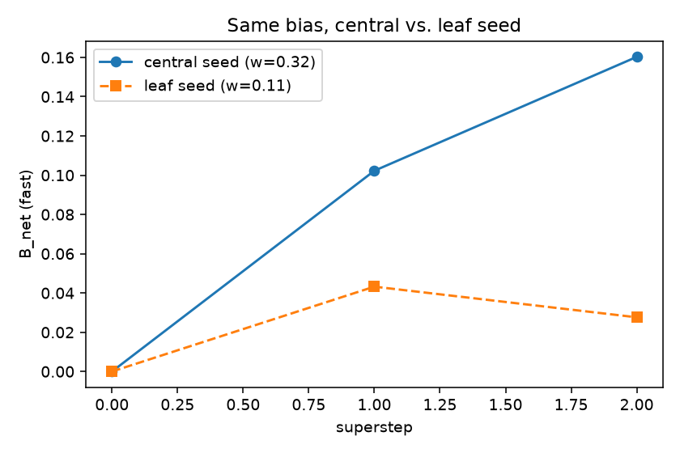
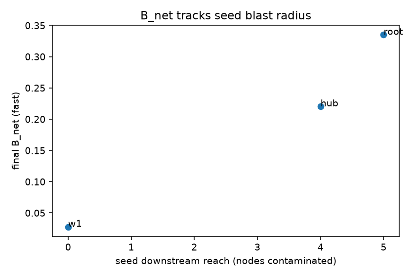
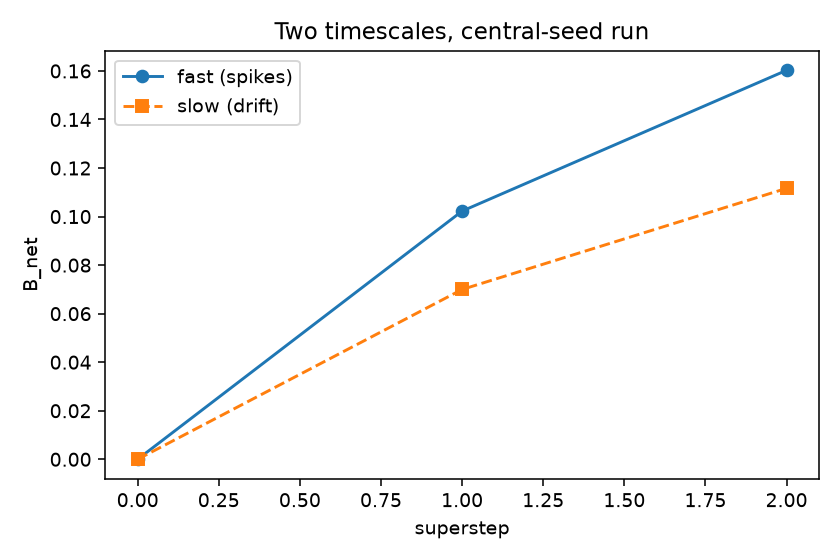

# Phase 2 propagation study

**Reproduce:** `python studies/phase2_propagation.py` (add `--quick` for a fast run). Every number
here comes from that script; raw output is in `phase2-results.json`, figures in `figures/`.

**What this shows and does not show.** This is measured on the ground-truth fake client, not a real
model. It demonstrates that the M2 propagation mechanics behave as designed — bias weighted by blast
radius, accumulated across execution — and quantifies the effect of *where* bias enters the graph. It
is **not** a claim about real multi-agent systems.

---

## Setup

A hub topology: `root → hub → {w1, w2, w3, w4}`. The `hub` fans out to four workers, giving it the
largest Katz blast radius; `w1..w4` are terminal leaves. A seed node is given a fixed bias
(`beta = 3.0`) that amplifies as it propagates downstream (capped); every node is scored through the
real `compute_local_bias → node_magnitude → Katz weight → NetworkAccumulator` stack, one accumulator
update per topological superstep. `B_net` is the fast-scale network signal.

## 1. Same bias, central vs. leaf seed

The headline result. Identical bias magnitude, seeded once at the central `hub` and once at the leaf
`w1`:

| Seed | Katz weight | Final `B_net` (fast) | Trajectory |
| --- | --- | --- | --- |
| `hub` (central) | 0.316 | **0.160** | `0.0 → 0.10 → 0.16` |
| `w1` (leaf) | 0.105 | **0.028** | `0.0 → 0.04 → 0.03` |

**The same bias produces ~5.8× more network-level signal when it enters at a central node than at a
leaf.** A biased leaf reaches nothing downstream and carries little weight, so `B_net` barely moves
and then decays; a biased hub contaminates all four workers and is weighted heavily, so `B_net`
climbs and stays up. This is the entire justification for topological weighting: a per-node bias
score is not actionable without knowing the node's blast radius.

## 2. `B_net` tracks blast radius

Seeding each of three positions of increasing downstream reach:

| Seed | Katz weight | Downstream reach | Final `B_net` |
| --- | --- | --- | --- |
| `w1` (leaf) | 0.105 | 0 nodes | 0.028 |
| `hub` | 0.316 | 4 nodes | 0.220 |
| `root` | 0.263 | 5 nodes | 0.335 |

`B_net` rises monotonically with the seed's **downstream reach** (0 → 4 → 5 nodes): a bias that can
contaminate more of the graph produces a larger network signal, as intended.

**An honest nuance worth recording.** The ordering by `B_net` (`root > hub`) does *not* match the
ordering by Katz weight (`hub > root`). Katz ranks `hub` above `root` because its α-discount (α=0.5)
penalizes `root`'s more-distant leaves; but the harness amplifies bias to *all* reachable nodes
without that discount, so `root` — which reaches one more node than `hub` — accumulates more. This is
a real interaction between the weighting attenuation and the propagation model, not a bug: if you
want `B_net` ordering to track Katz weight exactly, the propagation decay and the Katz α have to be
aligned. It is flagged here as a calibration consideration for M3's threshold work.

## 3. Two timescales

On the central-seed run, the fast and slow accumulators (α = 0.7 and 0.1):

| Superstep | fast | slow |
| --- | --- | --- |
| 0 | 0.00 | 0.00 |
| 1 | 0.10 | 0.07 |
| 2 | 0.16 | 0.11 |

The fast scale leads — it reaches a higher level sooner as the bias spreads, which is what a
spike detector should do; the slow scale lags, integrating the trend. Tripping on fast and
drift-alerting on slow (an M3 concern) is what these two scales are for.

---

## Takeaways for M3

- Blast-radius weighting works: identical bias is ~6× more impactful from a central node, and
  `B_net` tracks downstream reach. A threshold on `B_net` is therefore meaningfully
  topology-aware.
- The Katz-α / propagation-decay interaction (§2) means `B_net`'s absolute scale depends on both
  knobs; M3's threshold calibration should sweep them together rather than fixing one and tuning
  the other.
- Fast and slow scales separate cleanly, supporting a two-threshold (spike vs. drift) breaker.
