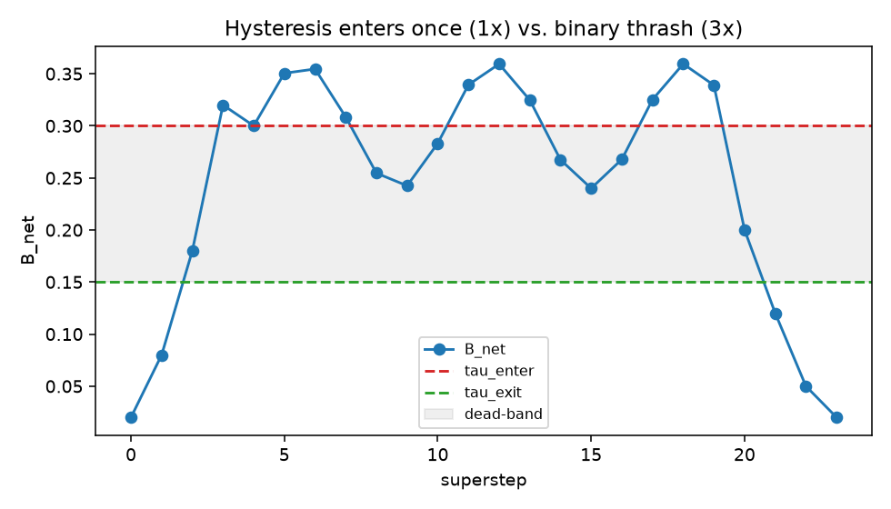

# Phase 3 control study

**Reproduce:** `python studies/phase3_control.py` (`--quick` for a fast run). Numbers come from that
script; raw output in `phase3-results.json`, figure in `figures/`.

**Scope.** This exercises the control-plane *mechanics* on synthetic `B_net` trajectories — it is not
a claim about real deployments. It shows the breaker does not thrash, the state machine recovers or
escalates as designed, and calibration hits a target false-halt rate.

---

## 1. Hysteresis prevents thrashing

A `B_net` trajectory that rises past `tau_enter = 0.30` and then oscillates inside the
`[tau_exit = 0.15, tau_enter]` dead-band before decaying, fed to two controllers:

| Controller | Times it enters Intervention |
| --- | --- |
| **Hysteresis** (two-threshold) | **1** |
| Naive binary threshold | **3** |

The binary controller flips into Intervention every time the signal wobbles back above `0.30`; the
hysteresis controller enters **once** and stays until the signal falls below the lower `tau_exit`,
then leaves cleanly. That single-entry vs. repeated-flip difference is the whole reason M3 uses a
dead-band rather than one threshold — a breaker that toggles every step is worse than no breaker.

## 2. The lifecycle recovers or escalates

The state machine on two trajectories (`cooldown_steps=1`, `max_retries=2`):

- **A spike that clears** — `normal → intervention → recovery → normal`. Once `B_net` falls below
  `tau_exit` and the cool-down elapses, the run re-enters Normal.
- **A persistent spike** — `normal → intervention → recovery → intervention → recovery → escalated`.
  When repair never brings `B_net` down, the machine retries up to `max_retries` and then escalates
  to a terminal state for human review, instead of looping forever.

Both paths are deterministic functions of the fed `B_net` and the machine's counters.

## 3. Calibration hits a target false-halt rate

There is no magic `tau`. Calibrating on unbiased control `B_net` (uniform noise) at a target
false-halt rate of **0.02**:

| | Value |
| --- | --- |
| target false-halt rate | 0.020 |
| chosen `tau_enter` | 0.979 |
| chosen `tau_exit` | 0.685 |
| **achieved false-halt rate (held-out)** | **0.0209** |

The chosen `tau_enter` produces a false-halt rate on held-out control within noise of the target.
Because `B_net`'s absolute scale is deployment-dependent ([Phase 2 study §2](phase2-propagation.md)),
this calibration path — not a shipped constant — is how a deployment sets its thresholds.

---

## Takeaways for M4

- The breaker is safe to wire into a live loop: it enters once, recovers when the signal clears, and
  escalates rather than looping when it does not.
- The `intervention_hook` is where M4's skeptic/MADERA repair plugs in; recovery already re-measures
  `B_net`, so a real repair that lowers bias will drive the machine back to Normal.
- `route_intervention` decides *which* repair to run (broad → skeptics, concentrated → MADERA); M4
  supplies the implementations behind that seam.
