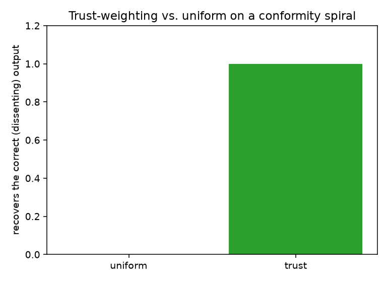

# Phase 4 intervention study

**Reproduce:** `python studies/phase4_intervention.py`. Numbers come from that script; raw output in
`phase4-results.json`, figure in `figures/`.

**Scope.** Measured on deterministic fakes (canned verdicts, a decay editor that models a working
repair), not real models. It demonstrates the intervention *mechanics* — routing, trust aggregation,
MADERA convergence, and the halt→repair→recover loop — and answers the honest question the trust
heuristic has to answer.

---

## 1. Does trust-weighting beat uniform? (the ablation)

The scenario is a **conformity spiral**: three overconfident skeptics (high confidence, no evidence)
insist the biased output STANDS, while one evidence-backed dissenter says REVISE and proposes the fix.

| Aggregator | Decision | Recovers the correct output? | Dissenter pruned? |
| --- | --- | --- | --- |
| **uniform** (baseline) | `stands` | ❌ no | no |
| **trust** | `revised` | ✅ yes | **no** |

Uniform majority-votes the biased consensus and the correct output is lost. Trust-weighting prunes
the three overconfident agents (`majority_1/2/3`) and the evidence-backed dissenter carries the
decision. **Trust earns its place here** — but note *why*: it helps precisely because the majority is
overconfident-without-evidence. It is not a universal improvement, and uniform remains the default
baseline; this is the specific regime (a conformity spiral) where trust is the right tool.

Crucially, in **both** modes the dissenter is never pruned — the minority-suppression guarantee.

## 2. MADERA converges

Iterative diagnose→retrieve→rewrite (decay 0.4 per pass, threshold 0.1):

| Injected bias β | Converged? | Rewrites |
| --- | --- | --- |
| 0.3 | ✅ | 2 |
| 0.5 | ✅ | 2 |
| 0.8 | ✅ | 3 |

Larger initial bias needs more rewrites, but all converge within the cap. A repair that does not
reduce bias would hit `max_rewrites` and return flagged not-converged (tested separately).

## 3. The full loop drops B_net

An end-to-end halt→repair→recover with the M3 control machine and the MADERA runner:

| | Value |
| --- | --- |
| `B_net` before | 0.80 |
| halt state | `intervention` |
| strategy routed | `madera` (concentrated bias) |
| `B_net` after repair | **0.072** |
| control state after | `normal` |

A biased payload trips the breaker; the runner routes to MADERA (the bias is concentrated in one
node); the repaired payload re-scores at 0.072, below `tau_exit`, so the control machine returns to
Normal. The loop closes with no coupling beyond M3 re-measuring `B_net`.

---

## Takeaways for M5

- The intervention layer produces an auditable trail (verdicts, pruned agents with reasons, MADERA
  rewrites) — M5 turns that into the causal audit record and SARIF export.
- Trust-weighting is genuinely useful but regime-specific; M5's reporting should make the pruning
  decisions and their reasons visible so an auditor can judge them.
