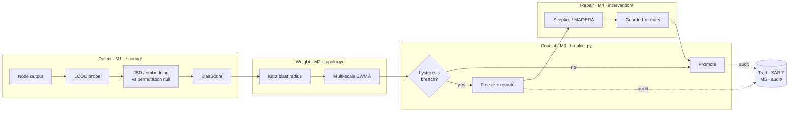
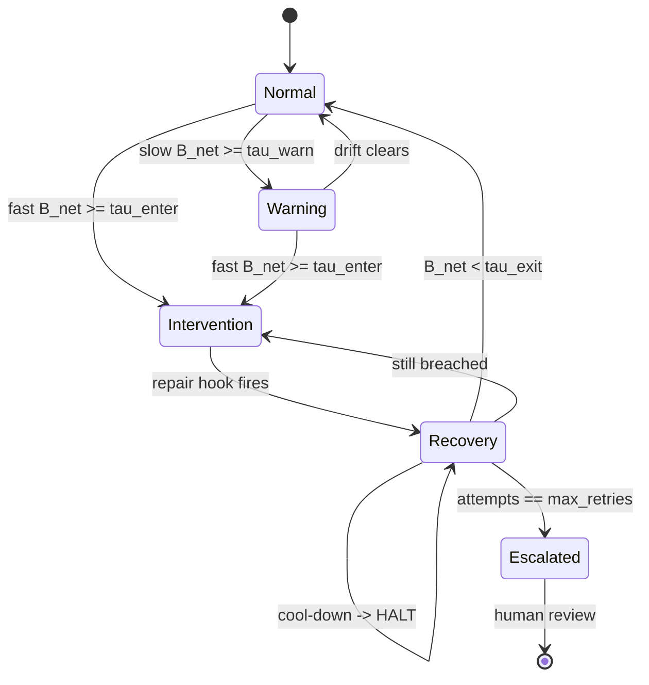

# Architecture

Five layered modules. Each is independently useful and testable, and depends only on the modules
before it. **The order is not negotiable** — every later module is a transformation of a number
M1 produces, and there is no way to recover from a bad M1 downstream.

## Module map

| Module | Package | Owns |
| --- | --- | --- |
| **M1** Detection | `scoring/` | Counterfactual perturbation, divergence estimation, per-node noise floor, significance testing |
| **M2** Propagation | `topology/`, `accumulation.py` | DAG, blast-radius centrality, composite weights, multi-scale bias-corrected EWMA |
| **M3** Control | `breaker.py`, `calibration.py` | Two-threshold hysteresis breaker, four-state machine, threshold calibration |
| **M4** Intervention | `intervention/` | Skeptic panel, trust-graph pruning, MADERA repair, routing |
| **M5** Evidence | `audit/` | Append-only causal trail, SARIF 2.1.0 export, HTML/JSON reports |

## Why M1 gets disproportionate effort

M2 multiplies M1's score by a weight. M3 compares it to a threshold. M4 fires when that threshold
trips. M5 reports on all of it.

If `B_i` is not a calibrated, meaningful quantity then M2 is weighting noise, M3 is thresholding
noise, M4 is spending real inference budget repairing outputs that were never biased, and M5 is
generating audit reports that certify nothing. **A wrong `B_i` will not announce itself** — the
system will run, produce numbers, trip occasionally, and be entirely wrong.

M2–M5 are comparatively well-understood engineering: known algorithms (Katz, EWMA) over known
framework primitives. They are work, but they are not research risk.

## The control lifecycle

Two thresholds, not one: the dead-band between `tau_enter` and `tau_exit` is what stops a `B_net`
sitting near the line from flipping the breaker every superstep.

## Where interception happens

The breaker trips on the **edge before the downstream node consumes the payload**, not after the
upstream node emits it. Emitting-then-checking is too late — the contaminated context has already
propagated. The LangGraph adapter implements this with a staging buffer: a node's output goes to
`unverified_output`, and only a passing breaker promotes it to `committed`.

## Design boundaries

- **Framework-agnostic core.** Scoring, topology, accumulation, and breaker logic depend only on
  numpy and networkx. LangGraph is a reference adapter shipped as an optional extra, never
  imported by the core.
- **Bring your own model.** No bundled LLM SDK. You supply a client callable; the library supplies
  protocols, math, and reference agents.
- **Ground truth lives in one place.** `testing/fake.py` is the only place bias is known by
  construction — that is what makes the studies checkable.

See **[Invariants](Invariants)** for the rules this architecture depends on.
