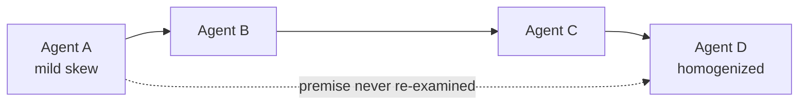
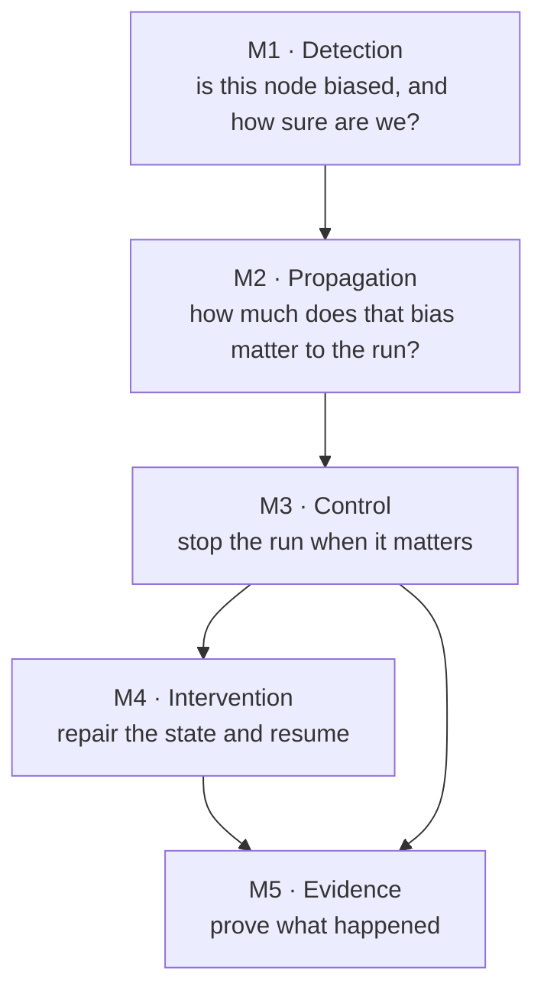

# weighted-emergent-bias

A runtime circuit-breaker for the **Degeneration-of-Thought (DoT)** problem in multi-agent LLM
systems.

| | |
| --- | --- |
| 📦 Install | `pip install weighted-emergent-bias` |
| 📖 Docs | <https://krishddd.github.io/weighted-emergent-bias/> |
| 🐍 PyPI | <https://pypi.org/project/weighted-emergent-bias/> |
| 💻 Source | <https://github.com/krishddd/weighted-emergent-bias> |

## What problem is this?

In a multi-agent pipeline, one agent's mildly stereotyped output becomes the next agent's ground
truth. No downstream agent re-litigates the premise it was handed — it builds on it. The bias
compounds through the graph until every stage has homogenized around the same skewed register.

Single-model alignment does not catch this. The bias is not in any one model's weights; it is in
**how the agents are wired together**.

## The five modules

Each module transforms a number the previous one produced, so **nothing later can be trusted if
something earlier is wrong**. That is why M1 gets disproportionate effort and its own calibration
study — a plausible-looking bias score that is actually measuring sampling temperature will not
announce itself.

## Wiki pages

- **[Getting Started](Getting-Started)** — install, first probe, first breaker
- **[Architecture](Architecture)** — how the five modules fit together
- **[Invariants](Invariants)** — the rules that must never be broken, and why
- **[Release Process](Release-Process)** — how a version gets cut and published
- **[FAQ](FAQ)** — scope questions, and what this deliberately does not do

## What this does not claim

No validated-performance claims on real models. The mechanics are implemented and demonstrated on
a synthetic harness with known ground truth. Numbers from the papers whose mechanisms are adapted
here (LOOC, MADERA, MALIBU, CortexDebate) are **theirs, on their setups**. Benchmark reproduction
is deliberately unscheduled.
