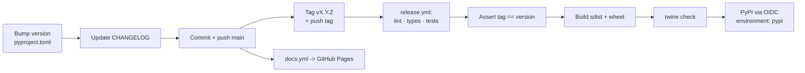

# Release Process

Releases are cut from `main` and published by GitHub Actions. Nothing is uploaded by hand.



## Steps

1. **Bump** `version` in `pyproject.toml`.
2. **Move** the `[Unreleased]` CHANGELOG entries under a new `[X.Y.Z] — YYYY-MM-DD` heading.
3. **Run the gate locally** — CI runs the same thing, but failing fast is cheaper:
   ```bash
   ruff check . && ruff format --check . && python -m mypy && pytest -m "not slow"
   ```
4. **Commit and push** to `main`. This deploys the docs site automatically.
5. **Tag and push the tag** — *this is the trigger that publishes to PyPI*:
   ```bash
   git tag -a vX.Y.Z -m "vX.Y.Z"
   git push origin vX.Y.Z
   ```

## What the release workflow guarantees

- The **full lint / type / test gate re-runs** in CI before anything is built. A PyPI version
  number can never be reused — even after a delete — so an unverified upload is permanent.
- The **git tag must match the packaged version**. This catches the classic "tagged v0.6.0, forgot
  to bump `pyproject.toml`" mistake before it becomes a permanently-wrong artifact.
- `twine check` validates the distribution metadata.
- Upload uses **PyPI Trusted Publishing (OIDC)** — no API token is stored in the repository.
  GitHub mints a short-lived identity; PyPI trades it for a scoped upload token.

## One-time setup

**PyPI trusted publisher** (pypi.org → project → Publishing → Add a new publisher → GitHub):

| Field | Value |
| --- | --- |
| PyPI project name | `weighted-emergent-bias` |
| Owner | `krishddd` |
| Repository name | `weighted-emergent-bias` |
| Workflow name | `release.yml` |
| Environment name | `pypi` |

**GitHub environment**: Settings → Environments → New environment → name it `pypi`. Restrict its
deployment branches/tags so only release tags can publish.

**GitHub Pages**: Settings → Pages → Build and deployment → Source = **GitHub Actions**. Without
this the docs deploy fails with "Pages site not found"; no workflow file can set it.

## If a publish fails

`release.yml` also accepts `workflow_dispatch`, so a failed run can be re-run from the Actions tab
without cutting a throwaway tag — useful for the very first release, before the trusted publisher
exists on PyPI's side.
